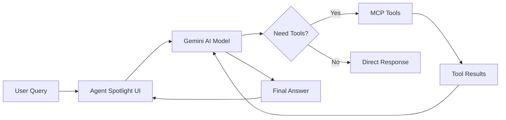

# 🔍 Agent Spotlight

<div align="center">

**The Desktop AI Agent That Actually Gets Stuff Done**

*Transform your desktop into an AI-powered command center. One keystroke. Infinite possibilities.*

[](https://tauri.app)
[](https://gemini.google.com)
[](https://rust-lang.org)
[](https://nextjs.org)

[Quick Start](#quick-start) • [Features](#features) • [Add Tools](#extensibility-the-game-changer) • [Examples](#real-world-examples)
*Hit Cmd+` and ask anything. Your AI agent will figure out the rest.*

</div>

---

## What Makes Agent Spotlight Special?

> **TL;DR**: This isn't just another AI chatbot. It's a desktop agent that can actually interact with your files, run commands, and integrate with any tool you want—all through natural language.

**The Problem**: Every AI assistant lives in a browser tab, disconnected from your actual work.

**The Solution**: Agent Spotlight brings AI directly to your desktop with:
- **Global hotkey access** (Cmd+` from anywhere)
- **Real tool integration** via Model Context Protocol (MCP)
- **Native desktop performance** (built with Rust + Tauri)
- **Beautiful, minimal UI** that stays out of your way
- **Infinite extensibility** - add any tool, API, or data source

---

## Features

### Core Features
- **Spotlight Interface**: macOS Spotlight-inspired design with global hotkey access
- **AI-Powered**: Uses Google's Gemini 2.5 Flash for intelligent query processing
- **Function Calling**: AI automatically decides when and which tools to use
- **Lightning Fast**: Native performance with Rust backend
- **Modern UI**: Built with Next.js, React, and Tailwind CSS
- **Cross-Platform**: Works on Windows, macOS, and Linux

### Advanced Features
- **MCP Integration**: Add any tool that supports Model Context Protocol
- **Smart Persistence**: Conversation history and settings saved locally
- **Privacy First**: Your API keys and data stay on your machine
- **Visual Feedback**: Real-time status updates as tools execute
- **Hot Reload**: Instant updates during development

---

## Extensibility: The Game Changer

**This is where Agent Spotlight becomes incredibly powerful.** Unlike other AI tools, you can teach it to use *any* tool or data source through the Model Context Protocol.

### What You Can Add:
- **File System**: Read, write, search files and directories
- **APIs**: Connect to REST APIs, databases, cloud services
- **Data Sources**: Parse CSV, JSON, XML, or any structured data
- **System Tools**: Run shell commands, manage processes
- **Integrations**: Git, Docker, Kubernetes, AWS, you name it

### Pre-configured Tools:
- **Filesystem**: Browse directories, read files, search content
- *(More coming soon)*

---

## Tech Stack

Agent Spotlight combines the best of modern technologies:

| Component | Technology | Why? |
|-----------|------------|------|
| **Frontend** | [Next.js](https://nextjs.org/) + [React](https://react.dev/) | Modern, fast, developer-friendly |
| **Styling** | [Tailwind CSS](https://tailwindcss.com/) | Utility-first, highly customizable |
| **Desktop** | [Tauri](https://tauri.app/) | Lightweight, secure, cross-platform |
| **Backend** | [Rust](https://www.rust-lang.org/) | Performance, safety, reliability |
| **AI Model** | [Google Gemini](https://deepmind.google/technologies/gemini/) | Advanced reasoning, function calling |
| **Extensibility** | [Model Context Protocol](https://modelcontextprotocol.io/) | Industry standard for AI tool integration |

---

## Quick Start

### Prerequisites
- [Node.js](https://nodejs.org/) (v18 or later)
- [Rust](https://www.rust-lang.org/tools/install)
- [Google AI API Key](https://aistudio.google.com/app/apikey) (free tier available)

### Installation

```bash
# 1. Clone the repository
git clone https://github.com/harshpreet931/agent-spotlight.git
cd agent-spotlight-app

# 2. Install dependencies
npm install

# 3. Set up your API key
echo 'GOOGLE_API_KEY="your-api-key-here"' > .env.local

# 4. Launch the app
npm run tauri dev
```

**That's it!** Hit `Cmd+`` (or `Ctrl+`` on Windows/Linux) to open Agent Spotlight from anywhere.

---

## Real-World Examples

### File Management
```
You: "Show me all TypeScript files in the src directory"
Agent: *Uses filesystem tools* → Lists all .ts and .tsx files
```

### Development Workflow
```
You: "Find all TODO comments in my project"
Agent: *Searches files* → Shows all TODO items with file locations
```

### Data Analysis
```
You: "What's the size of my largest files?"
Agent: *Analyzes filesystem* → Reports file sizes sorted by size
```

### System Information
```
You: "What's taking up space in my Downloads folder?"
Agent: *Scans directory* → Shows files by size and type
```

---

## How It Works

Agent Spotlight uses a sophisticated agentic architecture:



1. **You ask** in natural language
2. **Gemini analyzes** your request and available tools
3. **Tools execute** automatically when needed
4. **Results synthesize** into a helpful response
5. **You get answers**, not just chat

---

## Adding Your Own Tools

The real magic happens when you add your own tools. Here's how:

### 1. Find the Config File
```bash
# macOS
~/Library/Application Support/com.agentspotlight.spotlight/mcp_servers.json

# Windows
%APPDATA%/com.agentspotlight.spotlight/mcp_servers.json

# Linux
~/.config/com.agentspotlight.spotlight/mcp_servers.json
```

### 2. Add Your Tool Server
```json
{
  "mcpServers": {
    "filesystem": {
      "command": "npx",
      "args": ["-y", "@modelcontextprotocol/server-filesystem", "."]
    },
    "git": {
      "command": "python",
      "args": ["/path/to/your/git-mcp-server.py"]
    },
    "database": {
      "command": "node",
      "args": ["/path/to/database-server.js"]
    }
  }
}
```

### 3. Restart Agent Spotlight
Your new tools will be automatically discovered and available to the AI!

### Popular MCP Servers
- **[@modelcontextprotocol/server-filesystem](https://github.com/modelcontextprotocol/servers)**: File operations
- **[@modelcontextprotocol/server-git](https://github.com/modelcontextprotocol/servers)**: Git repository management
- **[@modelcontextprotocol/server-sqlite](https://github.com/modelcontextprotocol/servers)**: SQLite database access
- **[Custom servers](https://modelcontextprotocol.io/docs)**: Build your own!

---

## Roadmap

### Coming Soon
- [ ] **Global Hotkey Improvements**: Better cross-platform support
- [ ] **Tool Marketplace**: Discover and install MCP servers easily
- [ ] **Conversation Persistence**: Keep chat history across sessions
- [ ] **Result Previews**: Images, tables, rich content display
- [ ] **Custom Themes**: Personalize your spotlight experience

### Future Vision
- [ ] **Voice Commands**: Speak to your agent
- [ ] **Workflow Automation**: Chain multiple tools together
- [ ] **Team Sharing**: Share your custom tool configurations
- [ ] **Plugin Ecosystem**: Visual tool builder
- [ ] **Cloud Sync**: Sync settings across devices

---

## Contributing

We'd love your help making Agent Spotlight even better!

### Ways to Contribute:
- **Report bugs** or suggest features
- **Improve documentation**
- **Build MCP servers** for popular tools
- **Code contributions** (see our [contributing guide](CONTRIBUTING.md))
- **Star the repo** to show support!

### Development Setup:
```bash
git clone https://github.com/harshpreet931/agent-spotlight.git
cd agent-spotlight-app
npm install
npm run tauri dev
```

---

## License

MIT License - see [LICENSE](LICENSE) for details.

---

## Show Your Support

If Agent Spotlight helps you get stuff done faster, consider:

- **Starring this repo**
- **Sharing on Twitter** with #AgentSpotlight
- **Writing a blog post** about your use case
- **Contributing** a new MCP server

---

<div align="center">

**Built with ❤️ by developers who believe AI should be a tool, not a toy.**

[Get Started](#quick-start) • [Join Discussion](https://github.com/harshpreet931/agent-spotlight/discussions) • [Report Issue](https://github.com/harshpreet931/agent-spotlight/issues)

*Agent Spotlight - Where AI meets action.*

</div>
